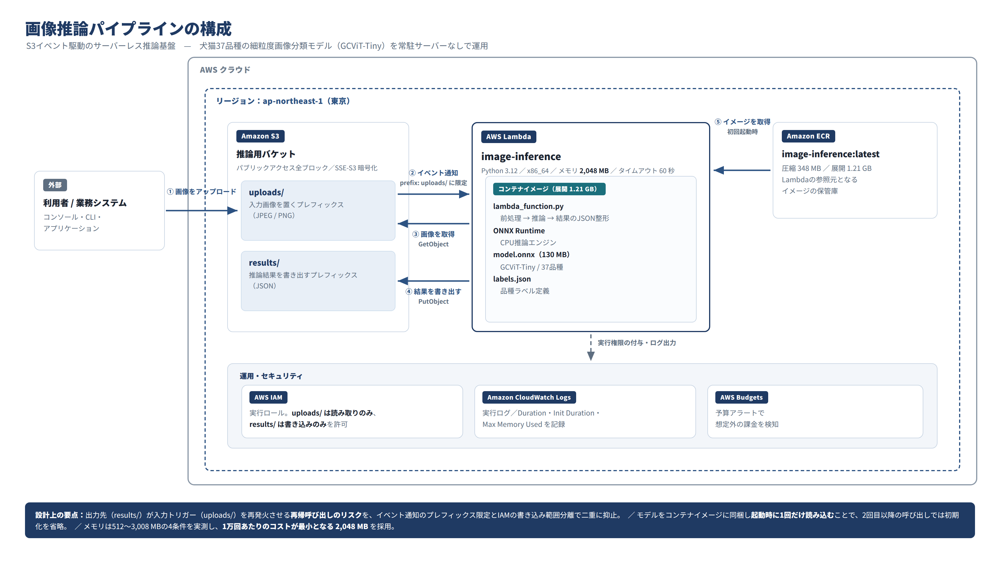

# S3イベント駆動 サーバーレス画像推論パイプラインの構築

犬猫37品種の細粒度画像分類モデル（GCViT-Tiny）を、AWS上で常駐サーバーなしに動作させる推論基盤です。
S3に画像を置くと自動的にLambdaが起動し、推論結果をJSONとして書き戻します。

**以前（[犬猫37品種の画像分類モデル構築](https://github.com/tomo13-tt/2_dog_cat_classification)）で作成したモデルを、実運用を想定した形で動かすことを目的としています。**

---

## アーキテクチャ



| 構成要素 | 役割 |
|---|---|
| **Amazon S3** | 入力画像（`uploads/`）と推論結果（`results/`）の保管。オブジェクト作成イベントの発火元 |
| **AWS Lambda** | 推論の実行。コンテナイメージ形式、Python 3.12 / x86_64 / メモリ 2,048 MB |
| **Amazon ECR** | Lambdaが参照するコンテナイメージの保管（圧縮 348 MB / 展開 1.21 GB） |
| **AWS IAM** | 実行ロール。`uploads/` は読み取りのみ、`results/` は書き込みのみを許可 |
| **CloudWatch Logs** | 実行ログと性能指標（Duration / Init Duration / Max Memory Used）の収集 |
| **AWS Budgets** | 予算アラートによるコスト監視 |

### 処理の流れ

1. 利用者が `uploads/` に画像を配置
2. S3のイベント通知（prefix: `uploads/` に限定）がLambdaを起動
3. Lambdaが画像を取得（`GetObject`）
4. 前処理 → ONNX Runtimeで推論 → 上位5品種をJSON化
5. `results/` に書き出し（`PutObject`）

### 出力例

```json
{
  "predictions": [
    { "label": "shiba_inu",   "display": "Shiba Inu",   "score": 0.9123 },
    { "label": "basset_hound","display": "Basset Hound","score": 0.0341 },
    { "label": "beagle",      "display": "Beagle",      "score": 0.0212 }
  ],
  "inference_ms": 84.3,
  "source_key": "uploads/dog01.jpg",
  "request_id": "8f3c1d2e-..."
}
```

---

## 技術選定と判断理由

### なぜコンテナイメージ形式か

Lambdaへのデプロイ方式は2つあり、それぞれ上限が異なります。

| 方式 | サイズ上限 | ECR |
|---|---|---|
| zip形式 | 250 MB | 不要 |
| **コンテナイメージ** | **10 GB** | 必須 |

ONNXモデルが130 MB、これに ONNX Runtime・NumPy・Pillow を加えると250 MBを超えるため、**コンテナイメージ形式を採用**しました。
Lambdaのコンテナイメージは **ECRからのみ読み込み可能**な仕様のため、ECRの利用はこの判断に伴って確定しています。

### なぜONNXに変換したか

PyTorchのモデルをそのまま動かすには PyTorch 本体（CPU版で約800 MB〜1 GB）が必要です。
ONNXに変換することで、**ONNX Runtime（66 MB）だけで推論が可能**になり、イメージサイズと初期化時間を大きく削減できます。

変換後は、PyTorchとONNXに同一入力を与えて**出力テンソルの数値一致を自動検証**しています（`rtol=1e-3, atol=1e-5`）。
変換ミスは例外を出さず結果だけがずれることがあるため、この検証を必須工程としています。

### なぜモデルをイメージに同梱したか

モデルをS3から起動時にダウンロードする構成も可能ですが、**コールドスタートのたびに130 MBの転送が発生**します。
イメージに同梱し、**コンテナ起動時に1回だけ読み込んでグローバル変数に保持**する方式としました。2回目以降の呼び出しでは初期化処理が完全にスキップされます。

---

## 性能計測とメモリ設定の最適化

Lambdaは割り当てメモリに比例してCPU性能も向上するため、**メモリ設定は速度とコストの両方に影響**します。
512 / 1,024 / 2,048 / 3,008 MB の4条件で実測しました。

### 計測結果

| メモリ | 種別 | Duration (ms) | Billed (ms) | Init Duration (ms) | Max Memory Used (MB) |
|---:|---|---:|---:|---:|---:|
| 512 | コールド | 1,615.87 | 4,698 | 3,081.63 | 501 |
| 512 | コールド | 1,809.49 | 3,858 | 2,047.52 | 500 |
| 512 | ウォーム | 1,862.56 | 1,863 | — | 500 |
| 1,024 | コールド | 870.01 | 3,026 | 2,155.83 | 512 |
| 1,024 | コールド | 909.55 | 3,987 | 3,076.62 | 511 |
| 1,024 | ウォーム | 802.65 | 803 | — | 522 |
| **2,048** | コールド | 424.82 | 3,034 | 2,608.77 | 507 |
| **2,048** | ウォーム | 376.03 | 377 | — | 518 |
| **2,048** | ウォーム | 369.53 | 370 | — | 519 |
| 3,008 | コールド | 344.40 | 3,176 | 2,831.55 | 509 |
| 3,008 | ウォーム | 325.31 | 326 | — | 519 |
| 3,008 | ウォーム | 310.42 | 311 | — | 520 |

### コスト比較（ウォーム実行 1万回あたり）

東京リージョン・x86 の料金（$0.0000166667 / GB秒、$0.20 / 100万リクエスト）で算出。

| メモリ | ウォーム平均 | 速度改善 | GB秒 | 1万回あたり | 前段比 |
|---:|---:|---:|---:|---:|---:|
| 512 MB | 1,862.56 ms | — | 0.9313 | $0.1572 | — |
| 1,024 MB | 802.65 ms | −57% | 0.8027 | $0.1358 | −13.6% |
| **2,048 MB** | **372.78 ms** | **−54%** | **0.7456** | **$0.1263** | **−7.0%** |
| 3,008 MB | 317.87 ms | −15% | 0.9337 | $0.1576 | **+24.8%** |

### 考察

**2,048 MBまでは「メモリを増やすほど速く、かつ安い」**という関係が成立しました。
メモリ単価は2倍になりますが、実行時間が半分より短くなるため、掛け算の結果としてコストが下がります。

**3,008 MBで逆転**しました。メモリ単価が47%増加したのに対し、実行時間の短縮は15%にとどまったためです。
Lambdaは **1,769 MBで1 vCPUをフル割り当て**し、それ以上は複数vCPUとなりますが、単一画像の推論は並列化の余地が限られるため、増やした分を活かせなかったと考えられます。

**以上より 2,048 MB を採用。** `Max Memory Used` は全条件で 507〜522 MB と一定であり、モデルの実需要は約520 MB。2,048 MB は約4倍の余裕を確保しつつコストが最小となる設定です。

**512 MB は使用率98%（501/512 MB）**で余裕がなく、実行時間も最長でした。メモリ圧迫がCPU性能の低さと重なったと考えられ、実用外と判断しています。

**コールドスタートはメモリ設定の影響をほとんど受けません。** Init Duration は全条件で 2,047〜3,082 ms とばらつくのみで傾向がなく、初期化がモデルファイル読み込み主体でCPU依存でないことを示しています。

### 計測の限界

- 各条件の測定回数はコールド1〜2回、ウォーム1〜2回であり、**統計的な有意差の検証は行っていない**
- Init Duration は同一条件内でも1秒以上のばらつきが観測された
- 30秒の間隔を空けても実行環境が再利用されずコールドスタートとなるケースがあり、**ウォーム再利用は保証されない**ことを確認
- 画像サイズ・内容による前処理時間の変動、AWS側の負荷変動は考慮していない

---

## イメージサイズの分析

展開後 1.21 GB の内訳を実測しました。

| 要素 | サイズ | 割合 | 削減可否 |
|---|---:|---:|---|
| AWS公式Lambdaベースイメージ | 753 MB | 62% | Lambdaランタイムに必須 |
| model.onnx | 130 MB | 11% | 量子化により削減余地あり |
| numpy + numpy.libs | 71 MB | 6% | 推論に必須 |
| onnxruntime | 66 MB | 5% | 推論エンジン本体 |
| PIL + pillow.libs | 21 MB | 2% | 画像読み込みに必須 |
| その他・メタデータ | 約169 MB | 14% | 一部のみ |

サイズの6割以上をベースイメージが占めており、**アプリケーション側で削減できる余地は限定的**です。
`boto3` / `botocore` はベースイメージに同梱済みであり、`requirements.txt` からの指定による重複インストールは発生していないことを実測で確認しました。

削減余地が最も大きいのは ONNXモデル（130 MB）で、INT8量子化により約35 MBまで圧縮可能と見込まれますが、精度への影響を伴うため別途検証課題としています。

---

## セキュリティ・運用上の設計

### 再帰呼び出し（無限ループ）の防止

推論結果を入力と同じバケットに書き戻す構成のため、**出力が入力トリガーを再発火させるリスク**があります。
これを二重に抑止しています。

1. **イベント通知のプレフィックス限定** — `uploads/` に置かれた場合のみLambdaを起動。結果は `results/` に書くため通知が飛ばない
2. **IAM権限の分離** — 実行ロールに `uploads/` への書き込み権限を与えない。コードに不具合があっても権限レベルで遮断される

片方の設定ミスやコード変更で防御が破れても、もう片方が機能する構成としています。

### IAM最小権限

```json
{
  "Version": "2012-10-17",
  "Statement": [
    { "Effect": "Allow", "Action": "s3:GetObject", "Resource": "arn:aws:s3:::<bucket>/uploads/*" },
    { "Effect": "Allow", "Action": "s3:PutObject", "Resource": "arn:aws:s3:::<bucket>/results/*" }
  ]
}
```

### その他

- S3バケットは**パブリックアクセスを全ブロック**、SSE-S3による暗号化を有効化
- **AWS Budgets** による予算アラートを設定し、想定外の課金を検知
- 検証用の一時的なIAMアクセスキーは、作業完了後に削除

---

## デプロイ前のローカル検証

推論処理を **S3に依存しない `predict()` 関数として分離**し、AWSの認証情報なしでコンテナ内から検証できる構成としています。

```bash
# ライブラリとモデルの読み込み確認
docker run --rm --platform linux/amd64 --entrypoint python image-inference:latest \
  -c "import lambda_function; print('OK')"

# 実画像による推論結果の確認
docker run --rm --platform linux/amd64 -v "$PWD/test:/test" \
  --entrypoint python image-inference:latest \
  -c "import json, lambda_function as lf; print(json.dumps(lf.predict(open('/test/pet.jpg','rb').read()), ensure_ascii=False, indent=2))"
```

クラウドへデプロイする前に、**手元のコンテナ内で実画像の推論結果を確認する**ことを必須工程としています。イメージのビルドとECRへの登録には数分かかるため、前処理やモデル読み込みの不具合をローカルで先に潰しておくほうが、試行のサイクルが短くなります。

---

## ディレクトリ構成

```
.
├── Dockerfile              # AWS公式Lambdaベースイメージから構築
├── requirements.txt        # 依存ライブラリ（バージョン固定済み）
├── lambda_function.py      # 前処理・推論・結果整形・S3入出力
├── model.onnx              # GCViT-Tiny / 37品種（130 MB）
├── labels.json             # 品種ラベル定義
├── scripts/
│   └── export_onnx.py      # PyTorch → ONNX 変換と数値一致検証
├── docs/
│   └── architecture.png    # アーキテクチャ図
└── test/
    └── pet.jpg             # ローカル検証用の画像
```

---

## セットアップ

### 前提

- Docker
- AWS CLI（認証情報設定済み）
- AWSアカウント（S3・Lambda・ECR・IAMの操作権限）

### 1. イメージのビルド

```bash
docker buildx build \
  --platform linux/amd64 \
  --provenance=false \
  -t image-inference:latest .
```

> `--platform linux/amd64` はAppleシリコン環境で必須です。省略するとLambdaで `exec format error` となります。
> `--provenance=false` を付けないとLambdaがイメージを受け付けません。

### 2. ECRへの登録

```bash
export AWS_REGION=ap-northeast-1
export AWS_ACCOUNT_ID=$(aws sts get-caller-identity --query Account --output text)
export ECR_URL=${AWS_ACCOUNT_ID}.dkr.ecr.${AWS_REGION}.amazonaws.com
export REPO_NAME=image-inference

aws ecr create-repository --repository-name ${REPO_NAME} --region ${AWS_REGION}
aws ecr get-login-password --region ${AWS_REGION} | docker login --username AWS --password-stdin ${ECR_URL}
docker tag image-inference:latest ${ECR_URL}/${REPO_NAME}:latest
docker push ${ECR_URL}/${REPO_NAME}:latest
```

### 3. AWSリソースの作成

| リソース | 設定 |
|---|---|
| S3バケット | `uploads/` `results/` を作成。パブリックアクセス全ブロック |
| Lambda関数 | **コンテナイメージ**を選択。メモリ 2,048 MB / タイムアウト 60秒 |
| 環境変数 | `BUCKET_NAME` にバケット名を設定 |
| IAMポリシー | 上記の最小権限ポリシーを実行ロールに追加 |
| S3トリガー | イベント：全オブジェクト作成／**プレフィックス：`uploads/`** |

> **プレフィックスの設定は必須です。** 未設定の場合、結果の書き込みが再びLambdaを起動し、無限ループとなります。

### 4. 動作確認

`uploads/` に画像をアップロードし、`results/` にJSONが生成されることを確認します。
実行ログは CloudWatch Logs の `/aws/lambda/image-inference` に出力されます。

```bash
aws logs filter-log-events \
  --log-group-name /aws/lambda/image-inference \
  --filter-pattern "REPORT" \
  --start-time $(( ($(date +%s) - 900) * 1000 )) \
  --query "events[*].message" --output text
```

---

## モデルについて

| 項目 | 内容 |
|---|---|
| アーキテクチャ | GCViT-Tiny（timm） |
| データセット | Oxford-IIIT Pet（犬猫37品種） |
| 学習方法 | 2段階の転移学習（Phase 1: ヘッドのみ 5 epochs → Phase 2: stages 2–3 を解凍し 15 epochs、label smoothing 0.1） |
| 入力サイズ | 224 × 224 |
| 正規化 | ImageNet標準（mean / std） |
| 形式 | ONNX（opset 17） |

モデルの学習と5モデルの比較検証については、[前案件のリポジトリ](https://github.com/tomo13-tt/2_dog_cat_classification)を参照してください。

---

## 制約と今後の課題

本リポジトリは**学習を目的とした個人開発**であり、実際の利用者を持つシステムとしては運用していません。
現時点で認識している制約を明記します。

### 制約

- **利用者向けインターフェースは未実装** — 画像の投入にはAWSアカウントへのアクセスが必要で、現状は開発者本人のみが操作可能
- **コールドスタートに2〜3秒** — リアルタイム応答が要求される用途には不適
- **GPU非対応** — LambdaはGPUを利用できないため、より大きなモデルや低レイテンシ要件には別構成が必要
- **構成がコード化されていない** — AWSリソースはコンソールでの手作業で構築しており、再現性が担保されていない
- **計測のサンプル数が少ない** — 前述の通り、統計的検証には至っていない

### 今後の課題

1. **S3署名付きURLの発行** — AWSアカウントを持たない利用者でも画像を投入できるようにする（Lambdaを1つ追加すれば実現可能で、費用対効果が最も高い）
2. **AWS SAMによる構成のコード化** — `sam deploy` / `sam delete` での構築・削除を可能にし、再現性とレビュー可能性を確保する
3. **モデルの量子化** — INT8化によるサイズ・速度・精度の3軸トレードオフの検証
4. **Lambda SnapStartの検討** — 2026年7月よりコンテナイメージ関数にも対応。ただしPythonランタイムではバージョン公開ごとにキャッシュ料金（最低3時間分）が発生するため、想定利用頻度との費用対効果を要検証

---

## 使用技術

**AWS** — Lambda / S3 / ECR / IAM / CloudWatch Logs / Budgets / AWS CLI  
**コンテナ** — Docker / Lambda Runtime Interface Emulator  
**モデル** — PyTorch / timm / ONNX / ONNX Runtime  
**言語・ライブラリ** — Python 3.12 / NumPy / Pillow / boto3  
**環境** — WSL2 (Ubuntu 24.04) / Google Colab / Git・GitHub
